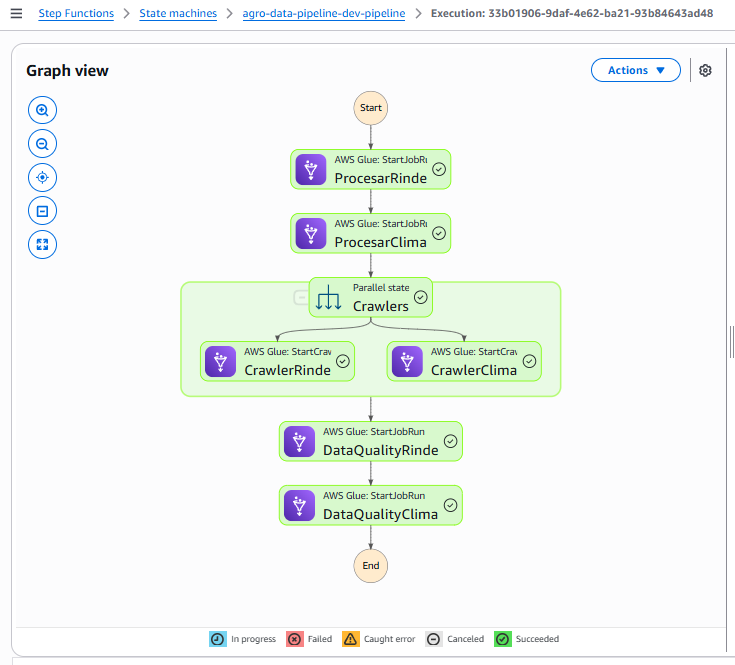

# Agro Data Pipeline

Pipeline de datos para procesamiento de información agrícola en AWS.

## 📋 Prerrequisitos

- AWS CLI configurado
- Terraform >= 1.0
- Python 3.9+

## 🏗️ Arquitectura

S3 Landing → Step Functions → Glue Jobs → S3 Curated → Crawlers → Glue Catalog → Athena
↓
Data Quality (Great Expectations)
↓
Resultados en S3 (dq_results/)

- **Ingesta**: CSV → S3 Landing
- **Procesamiento**: AWS Glue (PySpark)
- **Orquestación**: AWS Step Functions
- **Catálogo**: AWS Glue Data Catalog
- **Data Quality**: Great Expectations
- **Consumo**: Amazon Athena

## 📁 Estructura del Proyecto
agro_data/
├── .github/workflows/ # CI/CD
├── infra/ # Terraform
├── src/ # Código fuente
│ ├── ingestion/ # Jobs de Glue
│ └── dq/ # Data Quality
├── tests/ # Tests
└── orchestration/ # Step Functions


## Componentes implementados

### ✅ Infraestructura (Terraform)
- Buckets S3: landing, curated, scripts
- Roles IAM con mínimo privilegio
- Jobs de Glue (PySpark)
- Crawlers para actualizar catálogo
- Step Functions para orquestación
- Base de datos en Glue Catalog

### ✅ Procesamiento (PySpark)
- Lectura de CSVs desde landing
- Validaciones de rango (rinde 0-20000, temp -20-50, precip 0-500)
- Control de nulos en columnas críticas
- Escritura en formato Parquet particionado (campaña/lote)

### ✅ Data Quality (Great Expectations)
- Suite de validaciones para rinde_lotes
- Suite de validaciones para clima_diario
- Resultados almacenados en S3 (dq_results/)
- Reintentos automáticos para sincronización de catálogo

### ✅ Orquestación (Step Functions)
- Flujo secuencial: Rinde → Clima → Crawlers → DQ Rinde → DQ Clima
- Manejo de errores y reintentos
- Ejecución programada (CloudWatch Events)

### ✅ Seguridad (IAM)
- Perfil administrador (terraform apply)
- Perfil ingestión (solo escritura a landing)
- Perfil BI (solo lectura a curated y Athena)

### ✅ Monitoreo
- Logs en CloudWatch
- Métricas de ejecución
- Resultados DQ visibles en S3

## Costos estimados (mensuales)
- S3 (50GB): $1.15
- Glue (2 jobs x 10min/día): $3.50  
- Step Functions (30 ejecuciones): $1.00
- Athena (10GB escaneados): $0.50
- **Total: ~$6.15/mes**

## Comandos útiles

```bash
# Desplegar infraestructura
cd infra && terraform apply

# Subir scripts
./scripts/upload_scripts.sh

# Subir datos
./scripts/upload_data.sh

# Ejecutar pipeline
./scripts/run_step_function.sh

# Ver resultados DQ
aws s3 ls s3://agro-data-pipeline-dev-curated/dq_results/ --recursive

# Consultar en Athena
SELECT * FROM 'agro-data-pipeline_dev_db'.'rinde_lotes' LIMIT 10;

aws athena start-query-execution \
  --query-string "SELECT * FROM 'agro-data-pipeline_dev_db'.'rinde_lotes' LIMIT 10;" \
  --result-configuration "OutputLocation=s3://agro-data-pipeline-dev-curated/athena-results/" \
  --output text \
  --query 'QueryExecutionId'
```
 
## 🚀 Despliegue rápido

```bash
# 1. Clonar repositorio
git clone agro_data
cd agro_data

# 2. Desplegar infraestructura
cd infra
terraform init
terraform apply
cd ..

# 3. Subir scripts de Glue
./scripts/upload_scripts.sh

# 4. Subir datos de prueba
aws s3 cp data/rinde_lotes.csv s3://$(cd infra && terraform output -raw landing_bucket)/
aws s3 cp data/clima_diario.csv s3://$(cd infra && terraform output -raw landing_bucket)/


# Obtener los valores correctamente
cd infra
RINDE_JOB=$(terraform output -json glue_jobs | jq -r '.rinde_lotes')
CLIMA_JOB=$(terraform output -json glue_jobs | jq -r '.clima_diario')
LANDING_BUCKET=$(terraform output -raw landing_bucket)
CURATED_BUCKET=$(terraform output -raw curated_bucket)

# Verificar que se obtuvieron
echo "RINDE_JOB: $RINDE_JOB"
echo "CLIMA_JOB: $CLIMA_JOB"
echo "LANDING_BUCKET: $LANDING_BUCKET"
echo "CURATED_BUCKET: $CURATED_BUCKET"
cd ..

# Ejecutar job de rinde
aws glue start-job-run \
  --job-name ${RINDE_JOB} \
  --arguments '{"--input_path":"s3://'${LANDING_BUCKET}'/rinde_lotes.csv","--output_path":"s3://'${CURATED_BUCKET}'/rinde_lotes"}'

# Ejecutar job de clima
aws glue start-job-run \
  --job-name ${CLIMA_JOB} \
  --arguments '{"--input_path":"s3://'${LANDING_BUCKET}'/clima_diario.csv","--output_path":"s3://'${CURATED_BUCKET}'/clima_diario"}'

aws glue get-job-runs --job-name ${RINDE_JOB} --max-items 1
aws glue get-job-runs --job-name ${CLIMA_JOB} --max-items 1

# Ver archivos Parquet generados
aws s3 ls s3://${CURATED_BUCKET}/rinde_lotes/ --recursive
aws s3 ls s3://${CURATED_BUCKET}/clima_diario/ --recursive

# Ver archivos Parquet generados
aws s3 ls s3://${CURATED_BUCKET}/rinde_lotes/ --recursive
aws s3 ls s3://${CURATED_BUCKET}/clima_diario/ --recursive
```

## 🔄 Flujo completo del pipeline

### Pasos manuales (solo primera vez)
1. **Desplegar infraestructura**: `cd infra && terraform apply`
2. **Subir scripts**: `./scripts/upload_scripts.sh`
3. **Crear crawlers** (una vez): 
```bash
aws glue create-crawler --name "agro-rinde-crawler" --role arn:aws:iam::... --database-name agro_data_pipeline_dev_db --targets '{"S3Targets":[{"Path":"s3://.../rinde_lotes/"}]}'
aws glue create-crawler --name "agro-clima-crawler" --role arn:aws:iam::... --database-name agro_data_pipeline_dev_db --targets '{"S3Targets":[{"Path":"s3://.../clima_diario/"}]}'
```

## Pipeline automático (después de configurado)
```bash
# Opción 1: Ejecutar Step Function
aws stepfunctions start-execution \
  --state-machine-arn arn:aws:states:...:pipeline

# Opción 2: Trigger programado (CloudWatch Events)
# - Se ejecuta automáticamente cada día a las 8 AM
```

## Pipeline (Deploy MVP)
```bash
# 1. Desplegar infraestructura (UNA VEZ)
cd infra
terraform apply
cd ..

# 2. Subir scripts a S3 (UNA VEZ, o cuando cambien)
./scripts/upload_scripts.sh

# 3. Subir datos raw (CADA VEZ que llegan nuevos datos)
./scripts/upload_data.sh

# 4. Ejecutar Step Function (AUTOMATIZABLE)
./scripts/run_step_function.sh
```

## DAG


```bash
# 5. Consultar en Athena (A Demanda)
# (desde consola o script)
-- Ejemplo de consulta que podemos realizar
SELECT 
    r.lote_id,
    r.campana,
    r.rinde,
    c.temperatura,
    c.precipitacion
FROM agro_data_pipeline_dev_db.rinde_lotes r
JOIN agro_data_pipeline_dev_db.clima_diario c
    ON r.lote_id = c.lote_id 
    AND substr(r.fecha_cosecha,1,10) = c.fecha
WHERE r.rinde > 5000
LIMIT 10;
```

## Idempotencia en los jobs de Glue:
Los jobs ya son idempotentes porque:

Sobrescriben particiones con mode("overwrite")

Procesan archivo por archivo con timestamp en nombre

Si el mismo archivo se procesa dos veces → mismo resultado

## 🔐 Modelo de Seguridad (3 perfiles)

| Perfil | Responsabilidad | Permisos |
|--------|-----------------|----------|
| **Infra Creator** | Terraform, CI/CD | Full acceso a servicios |
| **Data Ingestor** | Subir CSVs a landing | S3 (landing bucket) |
| **BI User** | Consultas en Athena | Athena + Glue Catalog + S3 (lectura) |

## ⏰ Pipeline Automático

El pipeline se ejecuta automáticamente:
- **Schedule**: Todos los días a las 8 AM (CloudWatch Events)
- **Trigger manual**: Step Functions console o AWS CLI
- **Idempotente**: Los jobs sobrescriben particiones

## ✅ Data Quality

Great Expectations valida:
- No nulos en columnas críticas
- Rangos de rinde (0-20000)
- Rangos climáticos (temp -20/50, precip 0-500)
- Formato de fechas YYYY-MM-DD

Los resultados se guardan en S3 (`s3://.../dq_results/`)

## 📊 BI y Visualización

- **Athena**: Consultas SQL directas
- **QuickSight**: Dashboards interactivos
- **Conexión JDBC**: Tableau, PowerBI, etc.