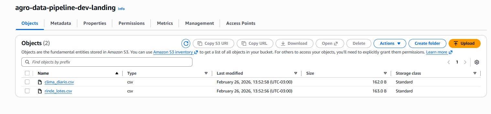
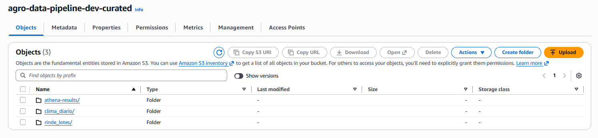
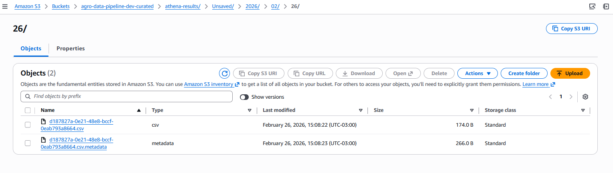
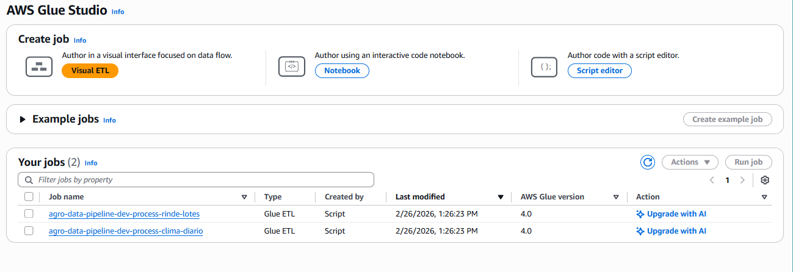
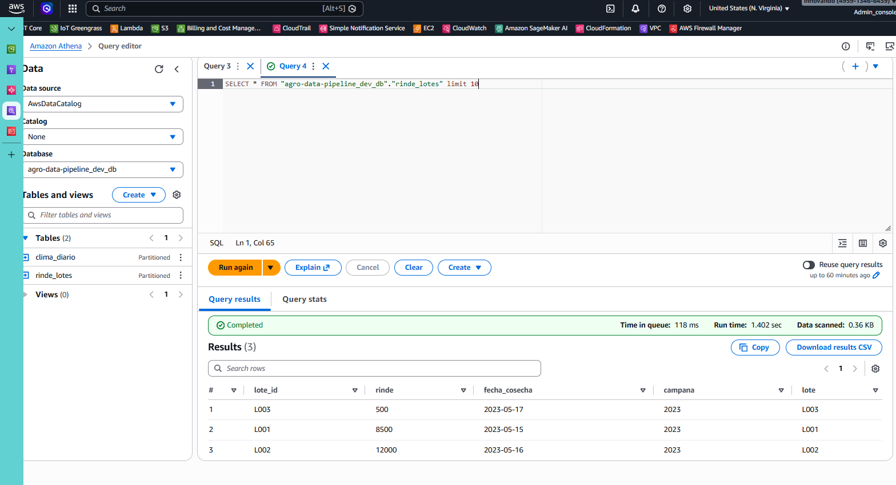

# Agro Data Pipeline

Pipeline de datos para procesamiento de información agrícola en AWS.
>Objetivo: Ingestar un CSV "rinde_lotes.csv" y "clima_diario.csv" a un bucket S3/curated en Parquet particionado por campaña y lote. Validar: rangos de rinde, % nulos, consistencia de fechas; exponer una vista para BI (Athena).

## 🏗️ Arquitectura

S3 Landing → Step Functions → Glue Jobs → S3 Curated → Crawlers → Glue Catalog → Athena
↓
Data Quality (Great Expectations)
↓
Resultados en S3 (dq_results/)

- **Ingesta**: CSV → S3 Landing
- **Procesamiento**: AWS Glue (PySpark)
- **Orquestación**: AWS Step Functions
- **Catálogo**: AWS Glue Data Catalog
- **Data Quality**: Great Expectations
- **Consumo**: Amazon Athena

## 📁 Estructura del Proyecto
```
agro_data/
├── .github/workflows/ # CI/CD
├── infra/ # Terraform
├── src/ # Código fuente
│ ├── ingestion/ # Jobs de Glue
│ └── dq/ # Data Quality
└── orchestration/ # Step Functions
```

## Componentes implementados

### ✅ Infraestructura (Terraform)
- Buckets S3: landing, curated, scripts
- Roles IAM con mínimo privilegio
- Jobs de Glue (PySpark)
- Crawlers para actualizar catálogo
- Step Functions para orquestación
- Base de datos en Glue Catalog

### ✅ Procesamiento (PySpark)
- Lectura de CSVs desde landing
- Validaciones de rango (rinde 0-20000, temp -20-50, precip 0-500)
- Control de nulos en columnas críticas
- Escritura en formato Parquet particionado (campaña/lote)

### ✅ Data Quality (Great Expectations)
- Suite de validaciones para rinde_lotes
- Suite de validaciones para clima_diario
- Resultados almacenados en S3 (dq_results/)
- Reintentos automáticos para sincronización de catálogo

### ✅ Orquestación (Step Functions)
- Flujo secuencial: Rinde → Clima → Crawlers → DQ Rinde → DQ Clima
- Manejo de errores y reintentos
- Próxima mejora: Ejecución programada (CloudWatch Events)

### ✅ Seguridad (IAM)
Se proveen los archivos de configuración de perfiles apropiados para los perfiles: (carpeta iam)
- Perfil administrador (terraform apply)
- Perfil ingestión (solo escritura a landing)
- Perfil BI (solo lectura a curated y Athena)

### ✅ Monitoreo
Es posible monitorear mediante:
- Logs en CloudWatch
- Métricas de ejecución
- Resultados DQ visibles en S3

## Costos estimados (mensuales)
- S3 (50GB) almacenamiento y operaciones: $1.15
- Glue (2 jobs x 10min/día) 2DPU: $8.40
- Step Functions (30 ejecuciones): $1.00
- Athena (10GB escaneados): $0.50
- **Total: ~usd 11.40/mes**

## 📋 Prerrequisitos

- AWS CLI configurado
- Terraform >= 1.0
- Python 3.9+

## 🚀 Comandos para Deploy y Operaciones

```bash
# 1. Clonar repositorio
git clone agro_data
cd agro_data

# Desplegar infraestructura
cd infra && terraform apply

# Subir scripts necesarios para el funcionamiento
./scripts/upload_scripts.sh

# Subir datos de ejemplo de la carpeta /data
./scripts/upload_data.sh
```


```bash
# Ejecutar pipeline (luego de que la infra está lista)
./scripts/run_step_function.sh

# Ver resultados DQ
aws s3 ls s3://agro-data-pipeline-dev-curated/dq_results/ --recursive
```





```bash
# Consultar en Athena (en su consola de queries)
SELECT * FROM 'agro-data-pipeline_dev_db'.'rinde_lotes' LIMIT 10;

# Realizar una consulta SQL desde la cli de aws
aws athena start-query-execution \
  --query-string "SELECT * FROM 'agro-data-pipeline_dev_db'.'rinde_lotes' LIMIT 10;" \
  --result-configuration "OutputLocation=s3://agro-data-pipeline-dev-curated/athena-results/" \
  --output text \
  --query 'QueryExecutionId'

# Ver archivos Parquet generados
aws s3 ls s3://agro-data-pipeline-dev-curated/rinde_lotes/ --recursive
aws s3 ls s3://agro-data-pipeline-dev-curated/clima_diario/ --recursive
```

## DAG




## Idempotencia en los jobs de Glue:
Los jobs son idempotentes porque:
- Sobrescriben particiones con mode("overwrite")
- Procesan archivo por archivo con timestamp en nombre
- Si el mismo archivo se procesa dos veces → mismo resultado

## ✅ Data Quality

Great Expectations valida:
- No nulos en columnas críticas
- Rangos de rinde (0-20000)
- Rangos climáticos (temp -20/50, precip 0-500)
- Formato de fechas YYYY-MM-DD


## 📊 BI y Visualización

- **Athena**: Consultas SQL directas

