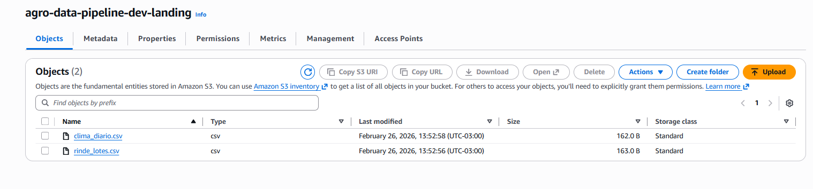
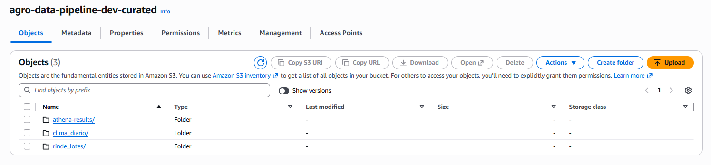
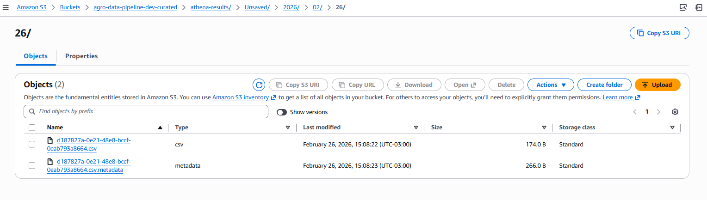
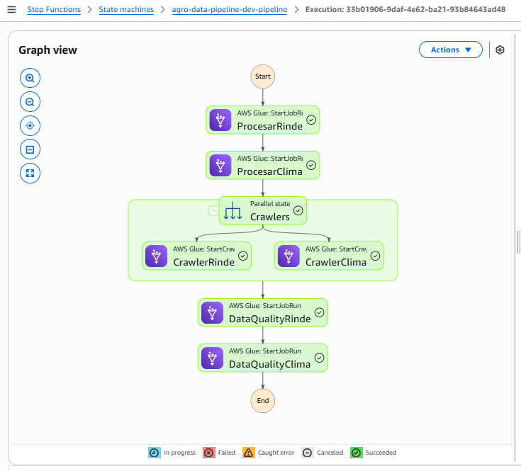
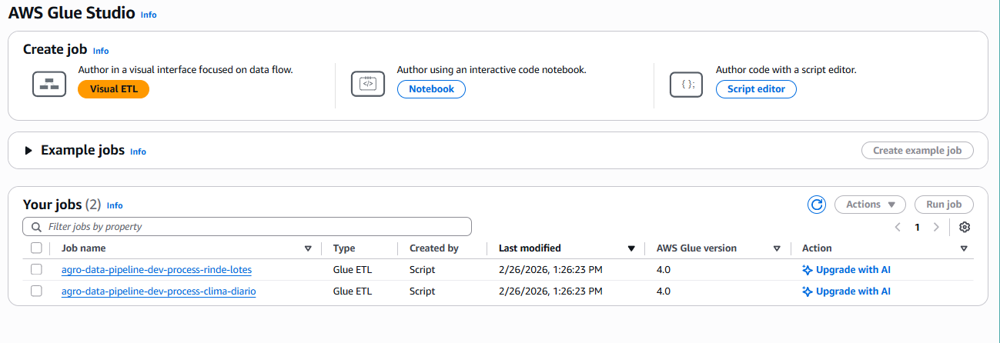
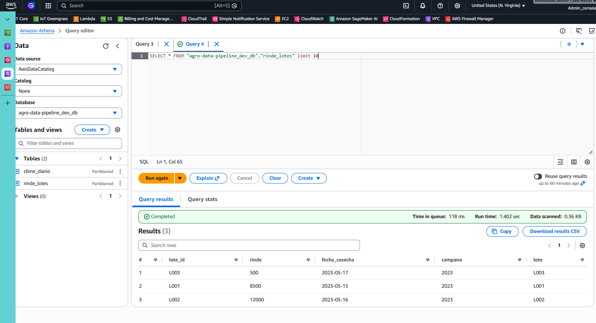

# Agro Data Pipeline

Data pipeline for processing agricultural information on AWS.
>Goal: Ingest a CSV "rinde_lotes.csv" and "clima_diario.csv" into an S3/curated bucket in Parquet partitioned by campaign and plot. Validate: yield ranges, % nulls, date consistency; expose a view for BI (Athena).

## 🏗️ Architecture
```
S3 Landing → Step Functions → Glue Jobs → S3 Curated → Crawlers → Glue Catalog → Athena
↓
Data Quality
↓
Results in S3 (dq_results/)
```

- **Ingestion**: CSV → S3 Landing
- **Processing**: AWS Glue (PySpark)
- **Orchestration**: AWS Step Functions
- **Catalog**: AWS Glue Data Catalog
- **Data Quality**: Checks
- **Consumption**: Amazon Athena

## Implemented Components

### ✅ Infrastructure (Terraform)
- S3 Buckets: landing, curated, scripts
- IAM roles with least privilege
- Glue Jobs (PySpark)
- Crawlers to update catalog
- Step Functions for orchestration
- Database in Glue Catalog

### ✅ Processing (PySpark)
- Reading CSVs from landing
- Range validations (yield 0-20000, temp -20-50, precip 0-500)
- Null control on critical columns
- Writing in partitioned Parquet format (campaign/plot)

### ✅ Data Quality
- Validation suite for rinde_lotes
- Validation suite for clima_diario
- Results stored in S3 (dq_results/)
- Automatic retries for catalog synchronization

### ✅ Orchestration (Step Functions)
- Sequential flow: Yield → Weather → Crawlers → DQ Yield → DQ Weather
- Error handling and retries
- Next improvement: Scheduled execution (CloudWatch Events)

### ✅ Security (IAM)
Appropriate profile configuration files are provided for the following profiles: (iam folder)
- Admin profile (terraform apply)
- Ingestion profile (write-only to landing)
- BI profile (read-only to curated and Athena)

### ✅ Monitoring
Monitoring is available via:
- CloudWatch logs
- Execution metrics
- DQ results visible in S3

## Estimated Costs (monthly)
- S3 (50GB) storage and operations: $1.15
- Glue (2 jobs x 10min/day) 2DPU: $8.40
- Step Functions (30 executions): $1.00
- Athena (10GB scanned): $0.50
- **Total: ~usd 11.40/month**

### ⚡ Optimization 1: Cost Reduction (Cost-efficient)
"For lower volume scenarios (<1GB), we could replace Glue Spark with Pandas on AWS Lambda"

|Change |	Impact |	Savings |
|-|-|-|
|Spark (2 DPU) → Pandas (Lambda 1GB)|	+3s latency|	-65%
|Glue Spark Jobs → Lambda (128MB)|	On-demand batch processing	|-$5.50/month
|Total optimized| |		~$5.90/month

### ⚡ Optimization 2: Performance and Scalability (High Performance)
To scale to terabytes and reduce latency, we optimize the Spark configuration and partitioning

|Change|	Impact|	Additional cost|
|-|-|-|
|Increase workers (2 → 5)|	-40% processing time|	+120%
|Partitioning by date+hour|	3x faster queries|	+15% (more files)
|Use Glue Workflows|	Optimized pipeline|	No extra cost
|Total optimized|	60% faster|	+35% ($15.40/month)|

## 🚀 Deploy and Operations Commands







## DAG




## Idempotency in Glue jobs:
Jobs are idempotent because:
- They overwrite partitions with mode("overwrite")
- They process file by file with timestamp in the name
- If the same file is processed twice → same result

## ✅ Data Quality

Validations:
- No nulls in critical columns
- Yield ranges (0-20000)
- Climate ranges (temp -20/50, precip 0-500)
- Date format YYYY-MM-DD


## 📊 BI and Visualization

- **Athena**: Direct SQL queries



## 🧪 Tests

```bash
$ pytest tests/unit -v
======================================== test session starts ========================================
platform linux -- Python 3.11.2, pytest-7.4.0, pluggy-1.6.0
collected 14 items

tests/unit/test_data_samples.py::test_lectura_rinde_csv ✓                                       [ 7%]
tests/unit/test_data_samples.py::test_lectura_clima_csv ✓                                       [14%]
tests/unit/test_data_samples.py::test_filas_invalidas_rinde ✓                                   [21%]
tests/unit/test_validators.py::TestRindeValidator::test_rinde_valido ✓                          [28%]
tests/unit/test_validators.py::TestRindeValidator::test_rinde_invalido ✓                        [35%]
tests/unit/test_validators.py::TestRindeValidator::test_rinde_limites ✓                         [42%]
tests/unit/test_validators.py::TestTemperaturaValidator::test_temperatura_valida ✓              [50%]
tests/unit/test_validators.py::TestTemperaturaValidator::test_temperatura_invalida ✓            [57%]
tests/unit/test_validators.py::TestPrecipitacionValidator::test_precipitacion_valida ✓          [64%]
tests/unit/test_validators.py::TestPrecipitacionValidator::test_precipitacion_invalida ✓        [71%]
tests/unit/test_validators.py::TestFechaValidator::test_fecha_valida ✓                          [78%]
tests/unit/test_validators.py::TestFechaValidator::test_fecha_invalida ✓                        [85%]
tests/unit/test_validators.py::TestNotNullValidator::test_not_null_valido ✓                     [92%]
tests/unit/test_validators.py::TestNotNullValidator::test_not_null_invalido ✓                   [100%]

===================================== 14 passed in 0.06s =====================================